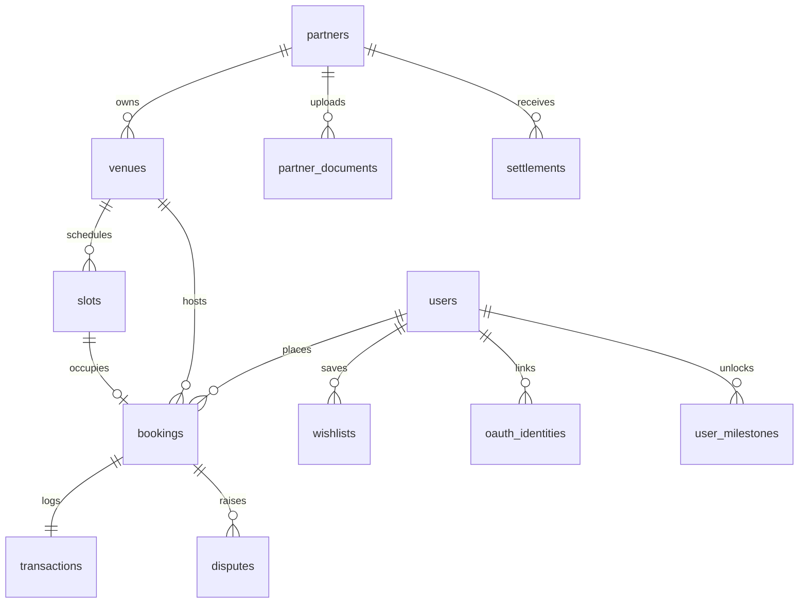

# Database Schema: Athlete's POV (APOV)

The database configuration utilizes PostgreSQL v16 and is orchestrated via Prisma ORM.

---

## Key Design Decisions

1. **UUID Primary Keys**: All primary keys are generated using `uuid_generate_v4()` to guarantee unique identifiers across systems.
2. **Prisma.Decimal Money Fields**: Monetary values are stored as `DECIMAL(10,2)` (never floats) to avoid floating-point rounding errors during financial settlements.
3. **Timestamptz Timezones**: Timezone-aware timestamps (`timestamptz`) are used globally (essential for Indian Standard Time (IST) adjustments).
4. **Composite Constraints**: Composite constraints (like on the `wishlists` table for `(user_id, venue_id)`) prevent duplicate records.
5. **Sports Types**: Venue sport options are stored as a string array (`String[]` / `text[]`) directly on the venue model to keep queries simple.
6. **Separate Stakeholders**: Users and Partners are placed in separate tables because they have different onboarding workflows and security contexts.

---

## Entity Relationship Overview

---

## Table Dictionary

The database contains the following tables:

### 1. `users`
End users (athletes/players).
- `user_id` (UUID, PK): Unique identifier.
- `phone_number` (String, Unique): Primary authentication identifier.
- `email` (String, Nullable): User email.
- `fcm_token` (String, Nullable): Firebase device token.
- `total_bookings` (Integer): Counter cache for milestones.
- `total_spend` (Decimal): Aggregated booking transactions.
- `created_at` (Timestamptz)

### 2. `partners`
Venue owners / host operators.
- `partner_id` (UUID, PK): Unique identifier.
- `phone_number` (String, Unique): Host authentication phone.
- `kyc_status` (Enum): `unverified` | `pending` | `verified` | `rejected`.
- `plan_tier` (String): Subscription tiers.
- `total_earnings` (Decimal): Net payouts.
- `fcm_token` (String, Nullable): Firebase device token.
- `created_at` (Timestamptz)

### 3. `venues`
Sports complexes / facility records.
- `venue_id` (UUID, PK): Unique identifier.
- `partner_id` (UUID, FK): Links to `partners`.
- `name` (String): Facility title.
- `sport_types` (String[]): List of playable sports.
- `status` (Enum): `unlisted` | `listed` | `suspended`.
- `avg_rating` (Decimal): Calculated rating averages.
- `base_price` (Decimal): Default listing slot price.
- `slot_mode` (String): Booking duration configurations.
- `created_at` (Timestamptz)

### 4. `slots`
Bookable calendar time slots.
- `slot_id` (UUID, PK): Unique identifier.
- `venue_id` (UUID, FK): Links to `venues`.
- `date` (Date): Slot calendar date.
- `start_time` (String): Slot starting hour (e.g. `18:00`).
- `end_time` (String): Slot ending hour (e.g. `19:00`).
- `price` (Decimal): Active price (including demand/surge tag updates).
- `status` (Enum): `available` | `booked` | `blocked_by_partner` | `blocked_by_admin`.
- `demand_tag` (String, Nullable): Active surge modifiers.

### 5. `bookings`
Booking transactions.
- `booking_id` (UUID, PK): Unique identifier.
- `user_id` (UUID, FK): Links to `users`.
- `venue_id` (UUID, FK): Links to `venues`.
- `slot_id` (UUID, FK): Links to `slots`.
- `status` (Enum): `PENDING` | `CONFIRMED` | `CANCELLED`.
- `payment_mode` (Enum): `card` | `upi` | `pay_at_venue` | `free`.
- `eticket_code` (String, Unique): Ticket check-in key (format: `APV-2026-XXXXXX`).
- `convenience_fee` (Decimal): Convenience charge.
- `commission_amount` (Decimal): Platform earnings.
- `gst_amount` (Decimal): Tax on commission.
- `partner_amount` (Decimal): Partner earnings.
- `online_amount` (Decimal): Collected online.
- `venue_amount` (Decimal): Collected at turf.
- `created_at` (Timestamptz)

### 6. `transactions`
Razorpay verification payloads.
- `txn_id` (UUID, PK): Unique identifier.
- `booking_id` (UUID, FK): Links to `bookings`.
- `razorpay_order_id` (String): Razorpay order identification.
- `razorpay_payment_id` (String, Nullable): Payment identifier.
- `txn_type` (String): Transaction operations (`capture` | `refund`).
- `txn_status` (String): Status code.
- `amount` (Decimal): Payment amount.
- `created_at` (Timestamptz)

### 7. `settlements`
Weekly platform payout ledger.
- `settlement_id` (UUID, PK): Unique identifier.
- `partner_id` (UUID, FK): Links to `partners`.
- `period_start` (Timestamptz): Invoice period start.
- `period_end` (Timestamptz): Invoice period end.
- `gross_amount` (Decimal): Net partner bookings.
- `platform_fee` (Decimal): Deducted commissions.
- `net_amount` (Decimal): Disbursed amount.
- `status` (Enum): `calculating` | `pending` | `on_hold` | `settled` | `failed`.
- `created_at` (Timestamptz)

### 8. `disputes`
Dispute claims.
- `dispute_id` (UUID, PK): Unique identifier.
- `booking_id` (UUID, FK): Links to `bookings`.
- `raised_by` (Enum): `user` | `partner`.
- `status` (Enum): `open` | `under_review` | `resolved` | `escalated`.
- `resolution` (Enum, Nullable): `refund_user` | `warn_partner` | `closed_no_action` | `escalated`.
- `details` (Text)

### 9. `refresh_tokens`
JWT sessions.
- `token_id` (UUID, PK): Unique identifier.
- `user_id` (UUID, FK): ID of the session owner.
- `role` (String): Stakeholder permissions.
- `token_hash` (String): Verification hashes.
- `device_info` (String, Nullable): Device info.
- `fcm_token` (String, Nullable): Session token tracking.
- `revoked_at` (Timestamptz, Nullable)
- `expires_at` (Timestamptz)

### 10. `otp_log`
OTP limits ledger.
- `otp_id` (UUID, PK): Unique identifier.
- `phone_number` (String): Target number.
- `otp_hash` (String): Hashed OTP.
- `expires_at` (Timestamptz): Verification expiration.
- `attempt_count` (Integer): Max login try tracking.

### 11. `oauth_identities`
Social profiles.
- `oauth_id` (UUID, PK): Unique identifier.
- `user_id` (UUID, FK): Links to `users`.
- `provider` (String): Identity provider (`google` | `apple`).
- `provider_user_id` (String): Social profile reference.

### 12. `venue_reviews`
Ratings.
- `review_id` (UUID, PK): Unique identifier.
- `venue_id` (UUID, FK): Links to `venues`.
- `user_id` (UUID, FK): Links to `users`.
- `booking_id` (UUID, FK): Links to `bookings`.
- `rating` (Integer): Rating stars (1 to 5).
- `comment` (Text): Feedback detail.
- `reply` (Text, Nullable): Host response text.

### 13. `wishlists`
Saves.
- `wishlist_id` (UUID, PK): Unique identifier.
- `user_id` (UUID, FK): Links to `users`.
- `venue_id` (UUID, FK): Links to `venues`.
*Note*: Enforces a unique composite constraint on `(user_id, venue_id)`.

### 14. `tournaments`
Competitions.
- `tournament_id` (UUID, PK): Unique identifier.
- `venue_id` (UUID, FK): Links to `venues`.
- `name` (String): Tournament title.
- `sport_type` (String): Competency sports category.
- `registration_fee` (Decimal): Entry fee.
- `status` (Enum): `upcoming` | `open` | `full` | `completed` | `cancelled`.
- `max_participants` (Integer): Team registrations ceiling.

### 15. `tournament_registrations`
Team entries.
- `reg_id` (UUID, PK): Unique identifier.
- `tournament_id` (UUID, FK): Links to `tournaments`.
- `user_id` (UUID, FK): Team manager link.
- `team_name` (String): Team title.
- `payment_status` (String): Checkout verification.

### 16. `notification_broadcasts`
FCM history logs.
- `broadcast_id` (UUID, PK): Unique identifier.
- `audience_type` (String): Targeted cohorts.
- `title` (String): Broadcast subject.
- `body` (Text): Messaging contents.
- `status` (String): Dispatch verification status.
- `sent_at` (Timestamptz)

### 17. `user_notifications`
In-app messaging channels.
- `notif_id` (UUID, PK): Unique identifier.
- `recipient_id` (UUID): Recipient ID (user or partner).
- `recipient_type` (String): Target app channels.
- `category` (String): Category filter mappings (`booking` | `kyc` | `settlement` | `alert`).
- `title` (String): Inbox subject.
- `body` (Text): Messaging body.
- `is_read` (Boolean): Read tracker status.
- `created_at` (Timestamptz)

### 18. `coupons`
Discount codes.
- `coupon_id` (UUID, PK): Unique identifier.
- `code` (String, Unique): Active discount key.
- `discount_type` (Enum): `percent` | `flat`.
- `discount_value` (Decimal): Active value amount.
- `max_discount` (Decimal, Nullable): Price ceiling on discounts.
- `min_order_value` (Decimal): Minimum booking amount.
- `usage_limit` (Integer): Total usage count.
- `per_user_limit` (Integer): Max limit per profile.
- `is_active` (Boolean): Active state flag.
- `valid_from` (Timestamptz)
- `valid_until` (Timestamptz)

### 19. `partner_documents`
KYC document assets.
- `doc_id` (UUID, PK): Unique identifier.
- `partner_id` (UUID, FK): Links to `partners`.
- `document_type` (String): GST certificate, PAN card, ownership proof, etc.
- `file_url` (String): Uploaded document S3 link.
- `status` (Enum): `pending` | `verified` | `rejected`.
- `rejection_note` (String, Nullable): Reject reasons details.

### 20. `banners`
Homepage banners.
- `banner_id` (UUID, PK): Unique identifier.
- `title` (String): Promotional headline.
- `image_url` (String): Carousel banner S3 asset.
- `link_url` (String, Nullable): Action redirects.
- `target_app` (String): Targeted interface (`user` | `partner` | `all`).
- `display_order` (Integer): Sort index.
- `is_active` (Boolean): Display toggle.

### 21. `user_milestones`
Unlocks.
- `milestone_id` (UUID, PK): Unique identifier.
- `user_id` (UUID, FK): Links to `users`.
- `milestone_type` (String): Unlocked type.
- `coupon_id` (UUID, FK): Issued discount coupon link.
- `created_at` (Timestamptz)
