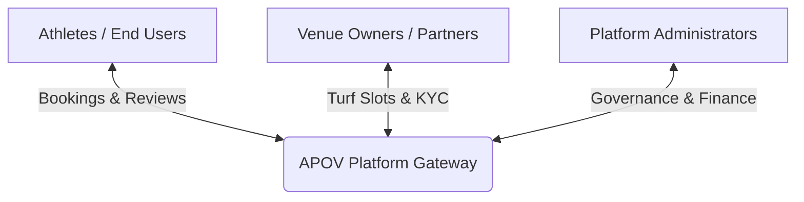

# Project Overview: Athlete's POV (APOV)

Athlete's POV (APOV) is a multi-sided sports venue booking platform designed to connect sports players, venue owners, and platform administrators. It provides a seamless, end-to-end digital ecosystem for booking sports slots, managing turfs/facilities, hosting tournaments, and handling payouts.

---

## The Stakeholders

APOV coordinates interactions between three primary user groups:

### 1. Athletes (User App)
- **Primary Goal**: Discover sports turfs/courts, check real-time availability, secure slots via online or cash payment, and participate in local tournaments.
- **Key Interactions**:
  - Search and filter turfs by city, sport, and price.
  - Reserve slots with slot-locking safety.
  - Unlock gamified milestones and apply discount coupons.
  - View check-in E-tickets with QR codes.

### 2. Venue Owners (Partner App)
- **Primary Goal**: List facilities, configure slot durations with dynamic/surge pricing, manage physical bookings, check-in players, and view earnings dashboard.
- **Key Interactions**:
  - Submit business verification details (KYC upload).
  - Create and manage court/turf assets via a multi-step setup wizard.
  - Build date-specific slot pricing tables and manually block hours for maintenance.
  - Verify checking-in players via E-ticket QR scanning.
  - Respond to user reviews and submit dispute statements.

### 3. Administrators (Admin Portal)
- **Primary Goal**: Govern the platform, moderate listings, verify partner compliance, settle payments, resolve disputes, and run promotional campaigns.
- **Key Interactions**:
  - Inspect and verify partner documents (GST certificates, PAN cards).
  - Approve, reject, or suspend venue listings.
  - Configure global milestone benchmarks and issue coupon codes.
  - Coordinate slot reassignments and initiate payment refunds.
  - Composes segment-targeted FCM notification broadcasts.
  - Audits user-partner chat logs and moderates user reviews.

---

## Core Applications

The APOV ecosystem consists of four distinct user-facing applications:

| Application | Platform Target | Primary Purpose | Key Capabilities |
| :--- | :--- | :--- | :--- |
| **User App** | Mobile (iOS & Android) | Venue discovery and checkout | Interactive search, slot booking calendar, payment gateway integration, coupon wallet, milestones. |
| **Partner App** | Mobile (iOS & Android) | Facility management | Multi-step venue builder, slot configuration grid, QR scanner, review replies, dispute responses, earnings export. |
| **Admin Portal** | Web / Desktop | Centralized administration | KYC document review queue, venue status panel, user database, finance ledgers, FCM broadcast composer, review moderation. |
| **Landing Website** | Responsive Web | Public promotional website | Showcases platform benefits, displays top-featured venues, and drives user/partner sign-up CTAs. |

---

## Revenue Architecture

The platform generates revenue through transactions:
1. **Convenience Fees**: A **4%** convenience fee is added on top of all online card/UPI bookings, charged to the customer.
2. **Booking Commissions**: The platform retains a **3%** commission on all confirmed bookings.
3. **GST Deductions**: An **18%** GST is applied strictly on top of the 3% platform commission.
4. **Pay-at-Venue splits**: Bookings pay a **30%** deposit online to secure the lock, with the remaining **70%** cash paid at the venue. Any outstanding commission from the 70% cash payment is settled during weekly administrative payout cycles.
