# Roadmap & Feature Completeness Logs: Athlete's POV (APOV)

This checklist tracks development progress, pending items, and outstanding requirements for the APOV sports venue booking engine.

---

## 1. Development Progress Summary

```mermaid
gantt
    title Feature Completeness Status
    dateFormat  X
    axisFormat %d%%
    
    section Core Infrastructure
    Razorpay Webhooks           :active, 100, 100
    Dark Mode System            :active, 100, 100
    
    section Authentication
    User/Partner OTP Auth       :crit, active, 85, 100
    Admin login and session     :active, 85, 100
    
    section Venue & Slots
    8-Step Setup Wizard         :active, 85, 100
    Slot grids & Lock engine    :active, 85, 100
    Multi-turf structure        :active, 65, 100
    
    section Payments & Billing
    Booking Checkout            :active, 80, 100
    Disputes & Refunds          :active, 70, 100
    Settlement Engine           :active, 55, 100
    
    section Integrations
    S3 Upload Engine            :active, 10, 100
    Invoice PDF generator       :active, 30, 100
    SMS/Email integrations      :active, 0, 100
```

---

## 2. Feature Implementation Status

### Core Infrastructure (100% Complete)
- [x] **Razorpay Webhook Verification**:
  - Raw request body parser order implemented in `app.ts` to preserve signature verification.
  - HMAC-SHA256 signature checks verify webhook events.
  - Webhook returns HTTP `200` to prevent duplicate transaction retries.
- [x] **Dark Mode Toggle**:
  - Theme toggles apply styling variables dynamically.
  - Dark/Light mode theme selections persist across sessions using Shared Preferences.

### High Completion (80% - 85% Complete)
- [ ] **User & Partner Authentication (85%)**:
  - OTP verification requests, logs, countdown timers, and token rotation verify sessions.
  - *Remaining Work*: Production security validation testing.
- [ ] **Admin Onboarding & Login (85%)**:
  - Admin login page, hardcoded bcrypt validations, and `X-Admin-Role` headers are implemented.
  - *Remaining Work*: Production session validation testing.
- [ ] **Venue Setup Wizard (85%)**:
  - The 8-step wizard guides partners through venue creation.
  - *Remaining Work*: Integration tests for final submit routing.
- [ ] **Slot Management Grids (85%)**:
  - Date picker calendars, slot grid lists, and slot blocking controls are implemented.
  - *Remaining Work*: Multi-user concurrency testing.
- [ ] **Booking Checkout Flow (80%)**:
  - Price calculations, convenience fees, and online payment options are implemented.
  - *Remaining Work*: End-to-end payment validation testing.

### Medium Completion (50% - 75% Complete)
- [ ] **Coupons & Banners Configuration (75%)**:
  - Discount validation logic and display priority ordering are set.
  - *Remaining Work*: Validate per-user limits across coupon uses.
- [ ] **Disputes & Refunds Ledger (70%)**:
  - Dispute forms, filing, and status updates are built.
  - *Remaining Work*: Automate refund triggers upon dispute resolution.
- [ ] **Multi-Turf Setup (65%)**:
  - Venue schemas support multi-turf structures.
  - *Remaining Work*: Integrate layout options into slot builders.
- [ ] **Settlement Engine (55%)**:
  - Payout logs and bank routing forms are implemented.
  - *Remaining Work*: Automate the weekly settlement run script.

---

## 3. Backlog & Integration Roadmap

### S3 KYC Document Uploads (10% Complete)
- **Status**: S3 pre-signed upload configurations are defined.
- **Goal**: Connect frontends directly to S3 upload links, bypassing server bandwidth consumption.
- **Tasks**:
  - [ ] Implement direct uploads for S3 PUT requests.
  - [ ] Add loading indicators and progress trackers (0% to 100%) to the partner dashboard.

### PDF Invoice Generation (30% Complete)
- **Status**: Backend PDF rendering scripts are created.
- **Goal**: Generate downloadable receipt copies upon booking confirmation.
- **Tasks**:
  - [ ] Add "Download PDF Invoice" buttons to user check-in pages.
  - [ ] Connect ticket data to invoice PDF templates.

### SMS & Email Notification Providers (0% Complete)
- **Status**: Coded placeholder routes console-log messages.
- **Goal**: Hook real email/SMS delivery systems to user events.
- **Tasks**:
  - [ ] Integrate third-party SMS APIs (e.g. Twilio) for OTP delivery.
  - [ ] Integrate SMTP/Transactional Email APIs (e.g. SendGrid) for booking invoices.
