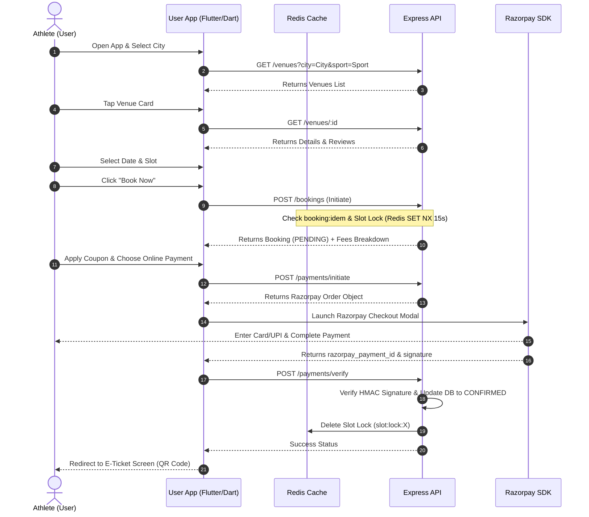
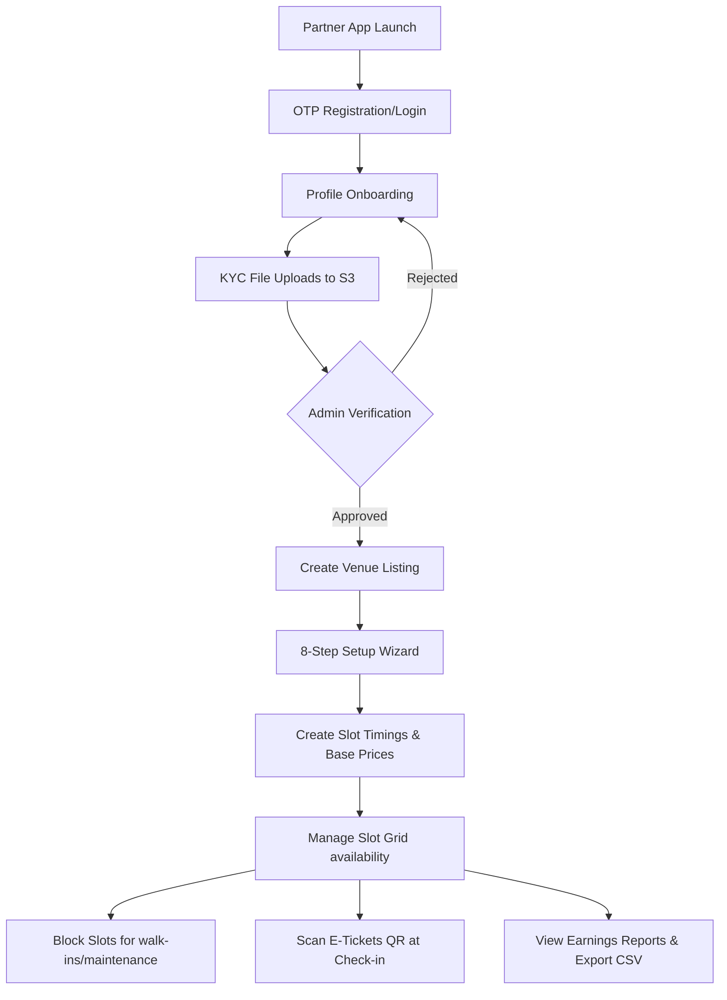

# User Flows: Athlete's POV (APOV)

This document maps the user flows for the three primary user groups: Athletes, Venue Partners, and Platform Admins.

---

## 1. Athlete / User Booking Flow

This flow describes the path a customer takes to find and book a sports slot.



### Flow Checklist:
1. **Initiate Booking**: Acquires 15-second Redis slot lock. Checks idempotency keys.
2. **Apply Coupon**: Verifies expiration dates and usage rules.
3. **Razorpay Checkout**: Launches modal overlays.
4. **Verification Webhook**: Razorpay sends webhook notifications asynchronously to confirm transactions as a fallback.
5. **Check-in**: E-Ticket displays player QR codes to check in at venues.

---

## 2. Venue Partner Onboarding & Slot Management Flow

This flow covers partner registration, KYC submission, venue listing, and slot configurations.



### Flow Checklist:
1. **KYC Documents**: Uploads GST/PAN files directly to S3 bucket.
2. **Setup Wizard**: Configures name, address, hours, photos.
3. **Slot Grid**: Renders hourly checklists.
4. **Manual Blocks**: Blocks active timings (gray-striped blocks).
5. **QR Check-in**: Scans E-Ticket codes at turfs.

---

## 3. Platform Admin Governance Flow

This flow maps how admins manage compliance, approvals, and dynamic price configurations.

```mermaid
graph LN
    A[Admin Login Portal] --> B[Operations Dashboard]
    B --> C[KYC Approval Queue]
    C -->|Verify S3 files| D[Verify Partner Status]
    B --> E[Venue Moderation Panel]
    E -->|Approve / Suspend| F[Update Venue Listings]
    B --> G[Demand Tags / Surge Grid]
    G -->|Surge Modifiers +50%| H[Update Slot Rates]
    B --> I[FCM Broadcast Panel]
    I -->|Push Targeted Alerts| J[Target User Segment]
    B --> K[Disputes Management Panel]
    K -->|Process Refunds| L[Initiate Razorpay Refund]
```

### Flow Checklist:
1. **KYC Viewer**: Inspects documents in-app.
2. **Venue Status**: Approves, rejects (with reasons), or suspends listings.
3. **Surge Pricing**: Selects slots to apply surge modifiers.
4. **Refund Processing**: Approves disputes, triggering Razorpay payouts.
